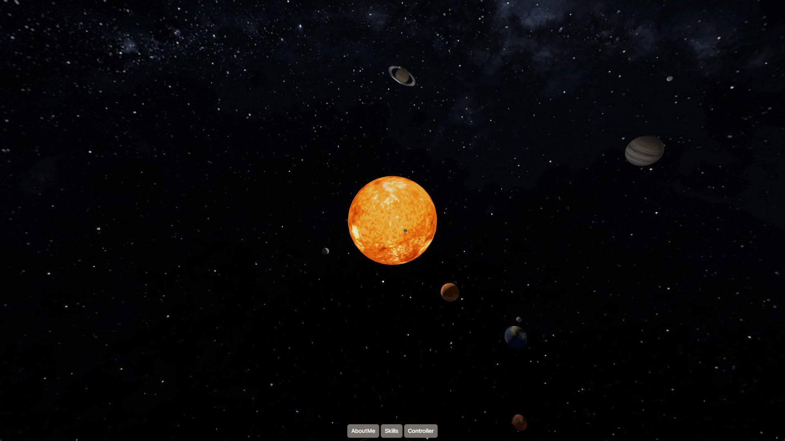

# Simple Solar System
> Three.js를 활용한 간단한 태양계 시뮬레이션

## 사용 기술
- Vue 3 — `^3.5.13`
- Pinia — `^3.0.1`
- Vite — `^6.0.5`
- Three.js — `^0.172.0`

## 주요 기능
- 3D 우주 공간에 태양계 행성 배치
- 각 행성의 자전 및 공전 애니메이션 구현
- 3개의 버튼이 존재하며, 클릭 시 지구, 목성, 태양으로 이동
- 버튼 클릭 시 다이얼로그가 열리며, 간단한 소개글과 컨트롤러 제공

## 스크린샷

## ℹ추가 정보
- 간단한 태양계 시뮬레이션입니다.
- 데스크탑 크롬 브라우저에 최적화되어 있습니다.

## 배포 링크
[serene1004.github.io](https://serene1004.github.io/)
